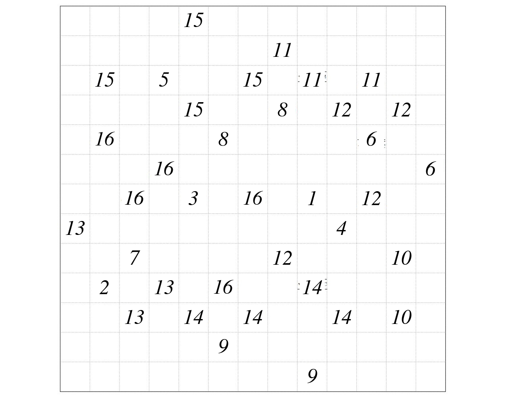
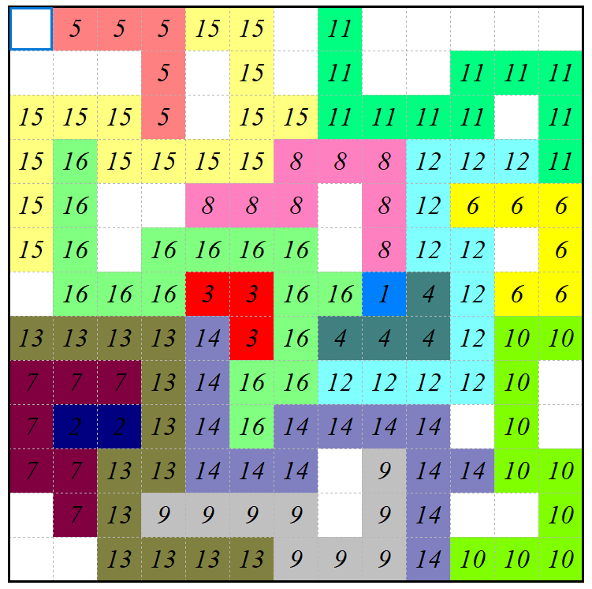

# Jane Street Puzzle (February 2026) — Solution Notes

This repository contains my workflow and artifacts for solving the Jane Street monthly puzzle from **February 2026**(https://www.janestreet.com/puzzles/subtiles-2-index/).

## What I did

My solution process was:

1. **Find a parameter combination \((a,b,c)\)** such that **every equation** in the puzzle has a **positive integer solution**.  
    I am aware that my search method was **not the most efficient** approach, but it was sufficient and led to a valid parameter setting.
    Solution: a=1/4, b=-3, c=1/2
    
2. **Replace the original equation image** with an analogous version containing the **evaluated values** (using the chosen \(a,b,c\)).
    

3. **Build a GUI** and use it to solve the puzzle configuration via **trial and error / iterative placement**.
    

4. **Compute the maximum and minimum row sums** of the final configuration and **multiply them** to obtain the final answer.
    [56, 64, 135, 162, 93, 133, 115, 129, 138, 120, 139, 89, 123]
    => 56 * 162 = 9072

## Notes

Published after the official Jane Street solution was available.
Jane Street lists my submission among the correct solutions for february 2026.